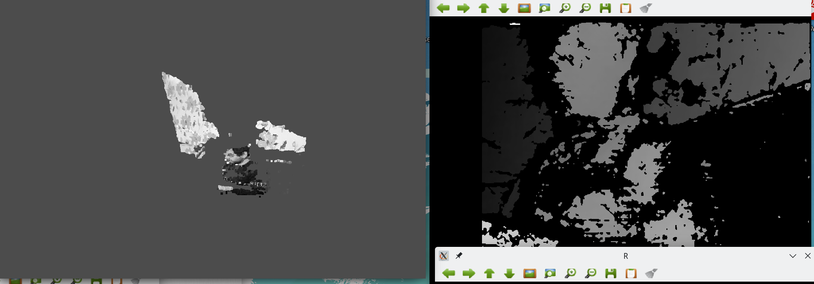

# Stereo reconstruction openCV with visualisation in opengl.

In this repo you will find a few apps:
1. Application that can get image from arducam stereo camera on rpi. **captureImageRpi**
2. Application that can get image from usb stereo camera on your pc. **captureImage**
3. Application that can get calibration data from captured images in yml format. **calibrate3D**
4. Application that can perform stereo reconstruction from stereo images and calibration data in yaml format writes ply files that you can open in meshlab or other applications. Also you can change app settings to improve stereoreconstruction. **reconstruct**
5. Application that reconstructs the video stream of your stereo camera into an opengl application. In opengl app you can change perspective by changing camera position. Also you can change app settings to improve stereoreconstruction. **stereoReconructVideo**
6. I'm planning to do application that i can reconstruct all a flat with one camera. I will be using aruco markers to get the camera position so I can add the cloud points in the correct location.

For the apps on rpi i used this camera:
* [ RpiCam ](https://www.arducam.com/product/arducam-1mp2-wide-angle-stereo-camera-for-raspberry-pi-jetson-nano-and-xavier-nx-dual-ov9281-monochrome-global-shutter-camera-module/)

For the apps on pc i used this camera:
* [aliexpress link](https://aliexpress.ru/item/1005003746856008.html?af=2926_Y6Ljx9&utm_campaign=2926_Y6Ljx9&aff_platform=api-new-link-generate&utm_medium=cpa&cn=22gerkbuymojxisqixse7lk8y8u4gtmc&dp=22gerkbuymojxisqixse7lk8y8u4gtmc&aff_fcid=278a1c50bc064ada93a2747a08c09ca2-1666732414553-06118-_Dl2eda7&cv=2&aff_fsk=_Dl2eda7&click_id=9mTZ1Xn2VbZnoVU&sk=_Dl2eda7&aff_trace_key=278a1c50bc064ada93a2747a08c09ca2-1666732414553-06118-_Dl2eda7&terminal_id=cf3cb91e30fd4502a2bdfbe75c754c0c&utm_source=aerkol&utm_content=2&sku_id=12000027022788321)

Examples:
* https://www.youtube.com/watch?v=6PwHKxQcqoM
* https://www.youtube.com/watch?v=6PwHKxQcqoM&ab_channel=AlexanderOrlov

Screenshots:
* 
* 